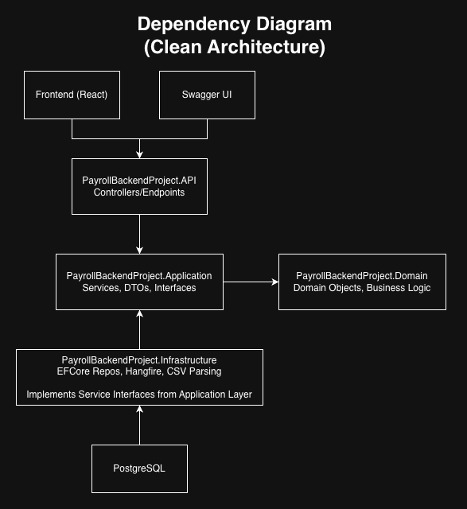
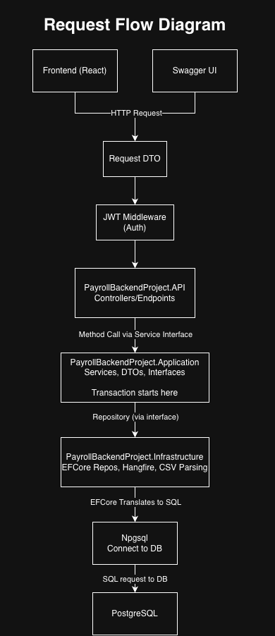
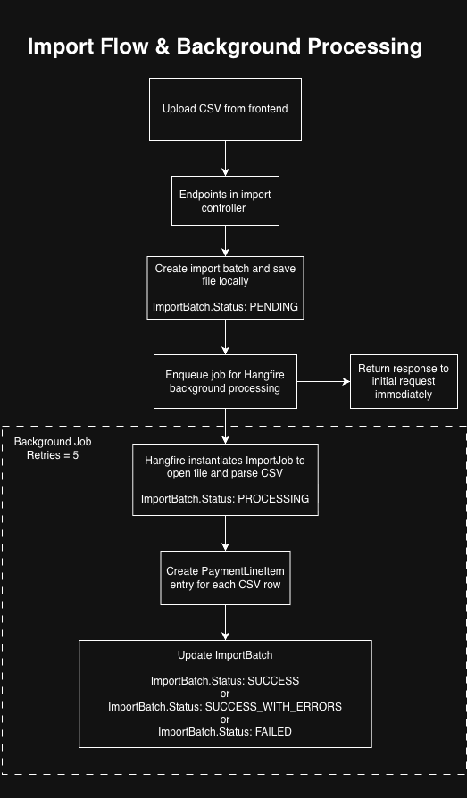

# Payroll Backend System

A backend system for processing clinician payroll in a healthcare setting, ingesting payment data, and generating structured pay statements.

Designed using Clean Architecture, with a focus on idempotent data ingestion, asynchronous processing, and audit-safe data modeling.

Portfolio: https://www.winstonheinrichs.com

---

## Tech Stack

- ASP.NET Core (C#)
- PostgreSQL
- Entity Framework Core
- Docker & Docker Compose
- JWT Authentication
- Hangfire (Background Jobs)

---

## Architecture

### Clean Architecture (Dependency Diagram)

Shows how dependencies are structured using Clean Architecture principles (inward dependency flow).



- API depends on Application  
- Infrastructure implements interfaces defined in Application  
- Domain contains core business logic  
- Dependencies point inward  

---

### Request Flow

Shows how a request moves through the system from API to service to database.



Flow:
- Controller receives HTTP request  
- DTO is validated and passed to Application service  
- Service executes business logic (transaction boundary)  
- Repository interface is called  
- EF Core translates LINQ to SQL  
- Npgsql sends query to PostgreSQL  
- Results mapped back to domain objects  

---

### Async Import Flow

Shows how CSV ingestion is handled asynchronously using background jobs.



Flow:
1. CSV uploaded via API  
2. ImportBatch created (PENDING)  
3. Hangfire job enqueued  
4. API returns immediately  
5. Background worker processes file  
6. Batch transitions to PROCESSING  
7. CSV parsed and validated  
8. PaymentLineItems created  
9. Batch marked COMPLETED or FAILED  

---

## Key Features

### Asynchronous Processing

- Handles long-running CSV ingestion using Hangfire  
- Keeps API responsive and scalable  
- Supports retry logic for transient failures  

---

### Idempotent CSV Ingestion

- Prevents duplicate processing using fingerprinting  
- Tracks batch-level and row-level errors  
- Supports safe retries without duplicating data  

---

### Payroll Processing

- Imports payment data from CSV files  
- Groups payments by clinician  
- Generates structured pay statements with:
  - total payments  
  - adjustments  
  - cost-sharing calculations  

---

### Secure Authentication

- JWT-based authentication  
- Role-based access (clinician vs admin)  
- Protected endpoints for sensitive data  

---

### Clean Architecture

- Clear separation of:
  - Domain (business logic)  
  - Application (use cases, interfaces)  
  - Infrastructure (EF Core, Hangfire, persistence)  
  - API (controllers)  
- Promotes testability, maintainability, and scalability  

---

## Key Design Decisions

- Snapshot-based payroll model  
  PaymentSnapshot ensures payroll data is immutable and audit-safe  

- Avoided many-to-many relationships  
  Replaced with snapshot-based modeling for clarity and correctness  

- ImportBatch as processing boundary  
  Enables idempotency, retries, and failure tracking  

- Separation of identity vs domain entities  
  Decouples authentication (UserAccount) from business logic (Clinician)  

- Status-driven workflows  
  Entities transition through controlled states (PENDING → PROCESSING → COMPLETED/FAILED)  

---

## Project Structure

```plaintext
PayrollBackendProject/
│
├── PayrollBackendProject/
│   ├── API/              # Controllers (entry points)
│   ├── Application/      # DTOs, services, interfaces
│   ├── Domain/           # Core business logic & entities
│   ├── Infrastructure/   # EF Core, repositories, DB access
│   ├── Migrations/       # Database schema history
│   ├── Dockerfile
│   ├── Program.cs
│   └── PayrollBackendProject.csproj
│
├── docker-compose.yml
├── .env.example
├── .gitignore
├── docs/                 # Architecture diagrams
└── README.md
```

---

## Setup & Run

### 1. Clone the repository

```bash
git clone https://github.com/your-username/PayrollBackendProject.git
cd PayrollBackendProject
```

---

### 2. Configure environment variables

```bash
cp .env.example .env
```

Update values as needed.

---

### 3. Run with Docker

```bash
docker compose up --build
```

---

### 4. Access the API

* API: http://localhost:5000
* Swagger UI: http://localhost:5000/swagger

---

## Database

* PostgreSQL runs in a Docker container
* Connection is configured via environment variables
* EF Core migrations are included for schema management

To apply migrations manually:

```bash
dotnet ef database update
```

---

## Environment Variables

Configuration is managed via `.env` (not committed to Git) but an example file is provided.

---

## Example Workflow

1. Upload CSV file via API endpoint
2. Background job processes file
3. Payment line items stored in database
4. System groups data by clinician
5. Pay statements generated

---

## Design Highlights

* **Idempotency-first ingestion design**
* **Separation of domain vs infrastructure logic**
* **Snapshot-based payroll calculations (immutable once approved)**
* **Scalable background job processing**
* **Environment-based configuration (no hardcoded secrets)**

---

## Future Improvements

* Auto-run EF migrations on startup
* Health check endpoint (`/health`)
* Deployment (Render / AWS)
* Cloud storage for uploaded files
* Audit logging enhancements

---

## Author

**Winston Heinrichs**

[View my other projects on my portfolio](https://www.winstonheinrichs.com)

---

## Notes

This project was built to demonstrate **real-world backend engineering skills**, including:

* API design
* database modeling
* background processing
* secure configuration management
* Dockerized environments

---
